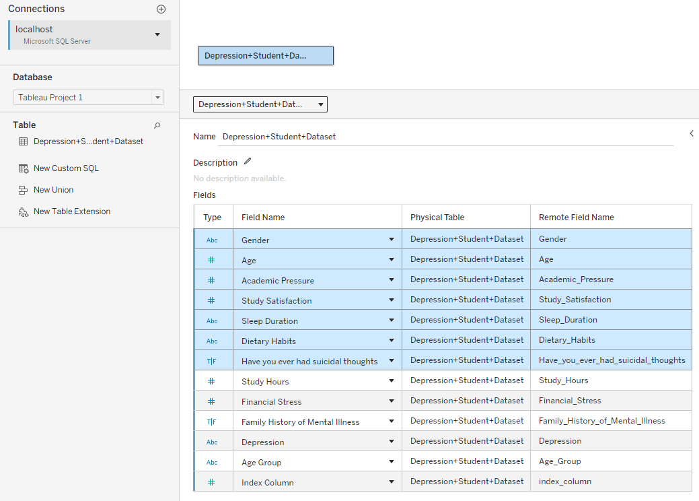
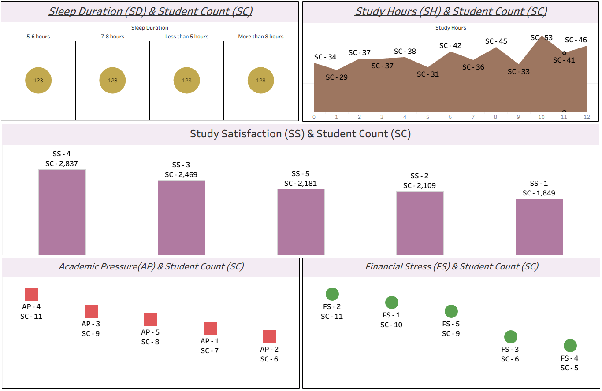

# 🎓 Student Depression Analysis — Tableau

## 📌 Project Overview

This Tableau project analyzes a **student depression dataset** using data prepared in SQL Server.

The project combines:

**SQL Server Data Preparation → Tableau → Student Well-Being Analysis**

The dashboard explores the relationship between student count and factors such as sleep duration, study hours, study satisfaction, academic pressure, and financial stress.

---

## 🎯 Project Objectives

- Analyze student counts across different **sleep-duration groups**.
- Examine student counts across **study hours**.
- Analyze student counts by **study satisfaction**.
- Explore student counts by **academic pressure**.
- Examine student counts by **financial stress**.
- Prepare the dataset in SQL Server before visualization in Tableau.

---

# 🗄️ Data Source — SQL Server

The dataset was prepared and queried using **Microsoft SQL Server / SSMS** before being used in Tableau.

The SQL preparation included:

- Checking the dataset and gender values.
- Checking for null values in `Age`.
- Reviewing the age distribution.
- Creating an `Age_Group` column.
- Creating a row-level `index_column`.
- Converting the `Depression` field from numeric `0/1` values to `No/Yes`.



---

# 🧹 Data Preparation

## Age Group

[View SSMS SQL →](sda_query.sql)

An `Age_Group` column was created in SQL Server using the following categories:

| Age Range | Age Group |
|---|---|
| 18–24 | A1 |
| 25–30 | A2 |
| Other ages | A3 |

The SQL implementation uses a `CASE` statement to create these groups.

## Depression Field

The original depression values were converted from numeric values into descriptive labels:

| Original Value | New Value |
|---:|---|
| 0 | No |
| 1 | Yes |

An identity-based `index_column` was also added to provide a unique row identifier.

---

# 📊 Tableau Dashboard

## 😴 Sleep Duration & Student Count

The dashboard compares student counts across different sleep-duration categories:

- 5–6 hours
- 7–8 hours
- Less than 5 hours
- More than 8 hours



---

## 📚 Study Hours & Student Count

The dashboard visualizes student counts across study-hour values, allowing study-time patterns to be compared across the student population.

---

## ⭐ Study Satisfaction & Student Count

Student count is analyzed across Study Satisfaction scores from **1 to 5**.

This provides a simple view of how the student population is distributed across different satisfaction levels.

---

## 📖 Academic Pressure & Student Count

The dashboard analyzes student counts across Academic Pressure levels.

This provides another dimension for exploring student well-being and academic-related factors.

---

## 💰 Financial Stress & Student Count

Student counts are also analyzed across Financial Stress levels.

Together with academic pressure and study satisfaction, this provides a broader view of factors associated with student well-being.

---

# 🔍 Analysis Covered

The dashboard focuses on five key dimensions:

| Dimension | Analysis |
|---|---|
| **Sleep Duration** | Student count by sleep-duration category |
| **Study Hours** | Student count by study hours |
| **Study Satisfaction** | Student count by satisfaction score |
| **Academic Pressure** | Student count by pressure level |
| **Financial Stress** | Student count by stress level |

---

# 🛠️ Skills Demonstrated

### 🗄️ SQL Server

- SQL database/table usage
- Data validation
- Null-value checking
- `UPDATE`
- `ALTER TABLE`
- `CASE`
- `GROUP BY`
- Identity column creation
- Data transformation

### 📊 Tableau

- Dashboard development
- Data visualization
- Categorical analysis
- Trend analysis
- Multi-dimensional analysis

### 📈 Data Analysis

- Student segmentation
- Distribution analysis
- Well-being factor analysis

---

## ⚙️ Tools & Technologies

`Microsoft SQL Server` • `SSMS` • `Tableau` • `SQL`

---

## 📁 Project Structure

```text
Student-Depression-Tableau/
│
├── README.md
├── Student-Depression-Analysis.twbx
├── Query for Student Depression Analysis.sql
└── images/
    ├── dashboard.png
    └── data-source.png
```

> The `.twbx` file contains the Tableau packaged workbook, while the SQL file documents the database preparation performed before visualization.

---

# ✅ Conclusion

This project demonstrates an end-to-end workflow in which a student depression dataset is **prepared and transformed in SQL Server** and then visualized in **Tableau**.

The project combines:

**SQL Server → Data Preparation → Tableau → Student Well-Being Analysis**
